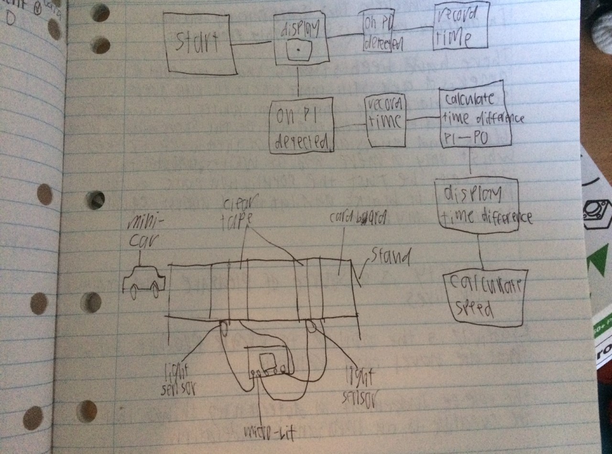
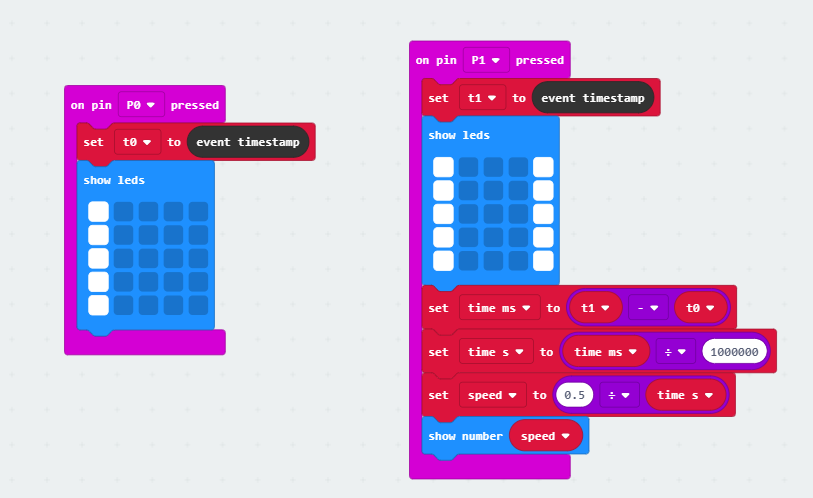

# Assessment 1: Replication project

## Replication project choice ##
Timing gates

## Related projects ##

### Related project 1 ###
Timing gates (original)

https://makecode.microbit.org/projects/timing-gates

This is the original project that my assesment was based off of.

## Reading reflections ##

### Reading: Don Norman, The Design of Everyday Things, Chapter 1 (The Psychopathology of Everyday Things) ###

Initially I had no idea how complex the processes of desighn could be before.

After reading, i learned more about the processes of desighn and the things to consider when creating interactive devices. The book detailed the features that are important and the terms used to describe them, such as affordances, signifiers and mapping.

The book did mention constraints as one of the important features of desighn, however, it did not go into as much detail about it as it did the other features. I am interested to hear more about how constraints are implemented in desighn.

As for how this relates to the task, taking desighn features into acount is very important for a task such as this. It is important to look at and implement these sorts of features to make the interactive project easier to understand. For example, the timing gates, when either is pressedd, will change the display on the microbit screen, which is an example of feedback.

### Reading: Chapter 1 of Dan Saffer, Microinteractions: Designing with Details, Chapter 1 ###

I did not have much prior knowledge about microinteractions outside of my exposure to microinteractions themself. I didn't realize the impacts that a poorly implemented system can have.

The reading made me aware of the importance of getting microinteractions right. The example at the start about patron x showed me how import microinterations are and how much a poorly excecuted microinteraction can drastically affect the overall experience.

I would be interested in learning more about how to effectively implement microinteractions.

I am not entirely sure of how many microinteractions are involved in my project, but this reading has definitely encouraged me to look into how I can improve the user experience of my project.

### Reading: Scott Sullivan, Prototyping Interactive Objects ###

I was aware of the difference between desighners and developers but i do sometimes use the terms interchangeably by accident.

This was a very interesting story that both subtly shows the stages of developement and provides confidence that coding, while it can be intimedating is extremely satisfying.

There isn't much about this reading that I need clarification on. However, I am interested in hearing more details about the project they made.

This reading did go over some of the stages of developement which i could use while working on my own project.

## Interaction flowchart ##

## Process documentation

The process involved taking the initial project of the timing gates and adjusting it to be more precise and actualy calculate the speed rather than just the time. the speed gates also must be able to calculate the speed of objects other than a car. The initial idea was to use a light sensor to detect when the object goes past. However, the light sensors were also far too inacurate and after going over multiple ideas we finaly came up with a mechanism that might work. it uses buttons instead of light sensors and uses a cut up skewer to reach the button.

## Project outcome ##

### Project title ###
speed gates
### Project description ###

the speed gates measure the speed of small objects passing through. the speed gates are too imprecise for scientific use, however, they could make a fun toy for young children interested in science or playing with toy cars. the timng gates require a small ofject to pass the two pannels and press them down, so it can be used by children to challenge themselves or their friends to roll objects across the board.

### Showcase image ###

### Reflection ###

the project went very well in my opinion. there wern't too many issues, however, i discovered that the buttons aren't pressed if the object goes over the switches too fast and if you roll an object too slow it may not make it across.

i did not use any other projects for assistance and much of the original project made things harder. i did however, share some ideas with my father before coming up with the final design.

this project, although inaccurate, if improved could help with basic science and recording the speed of rolling objects.
