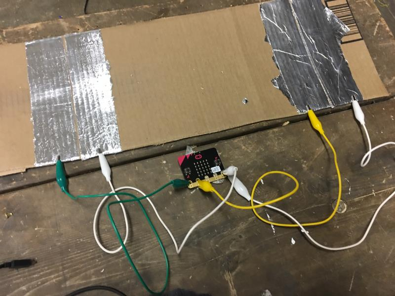
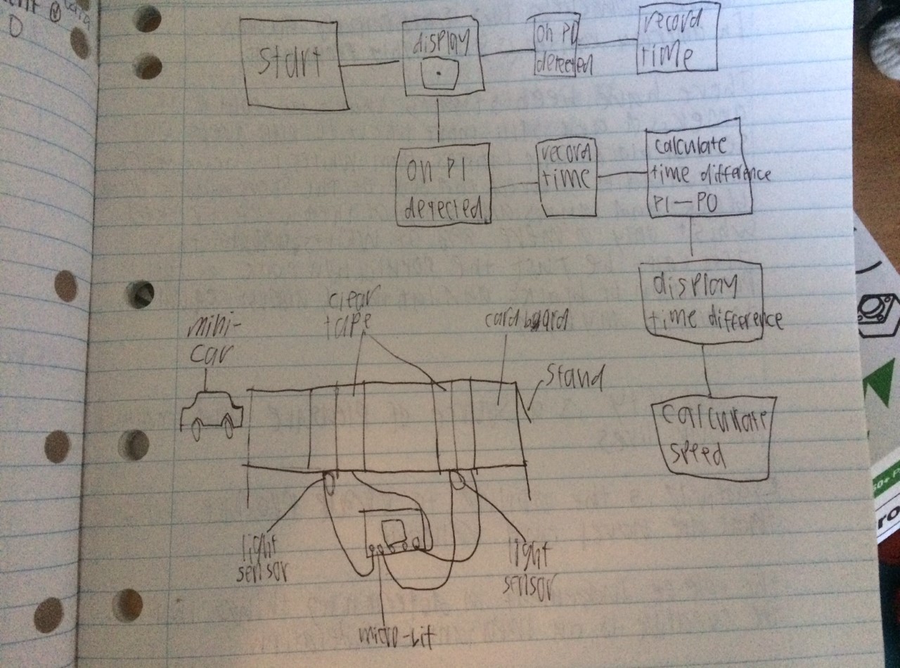
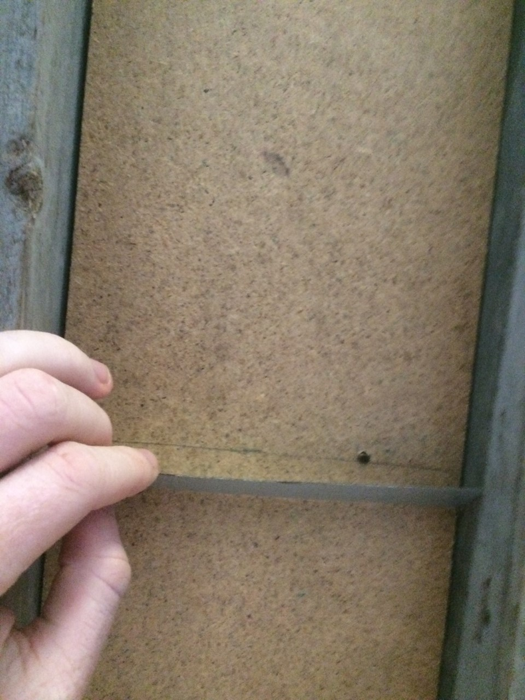
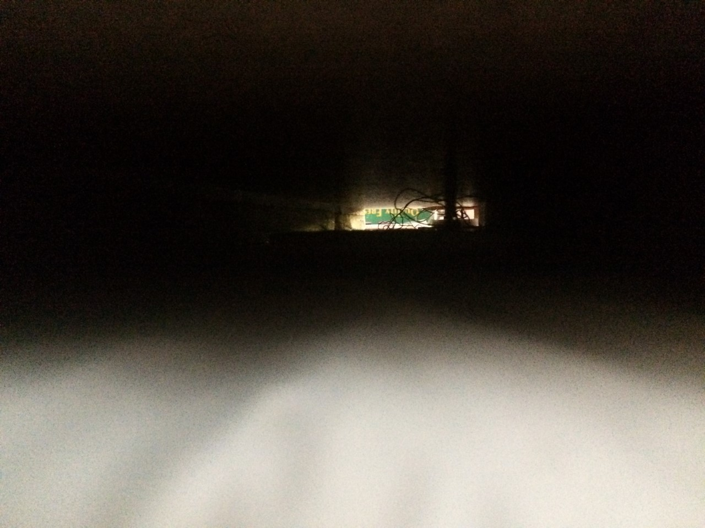
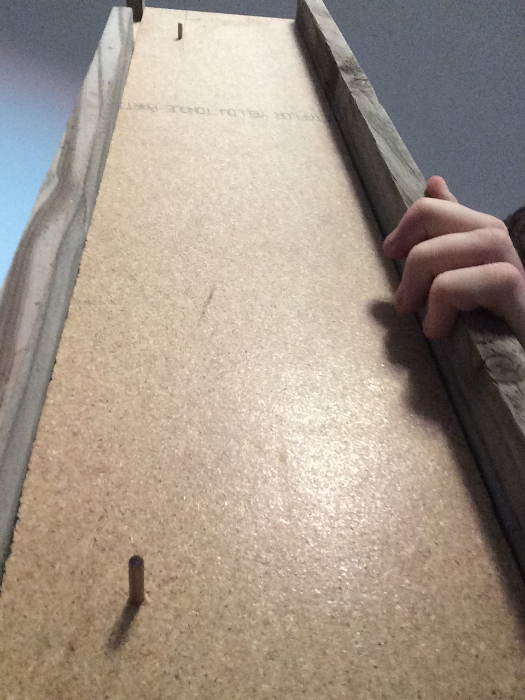
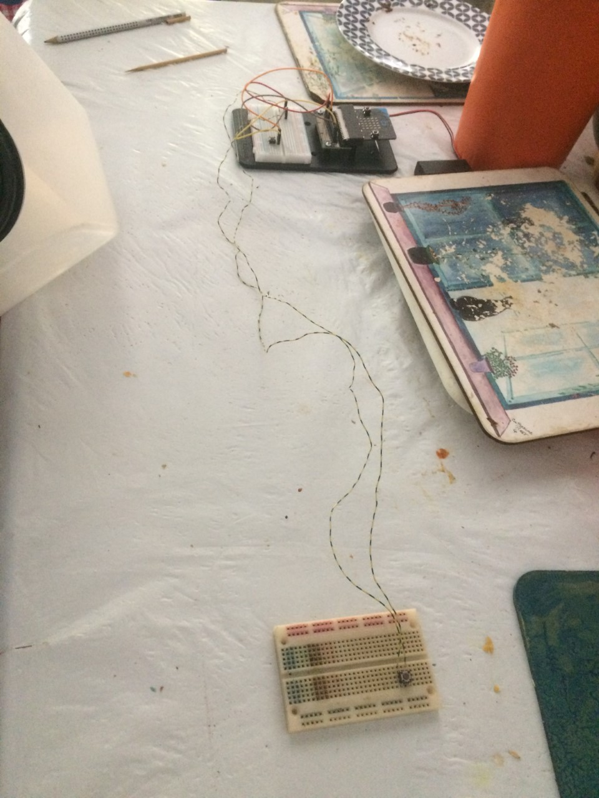
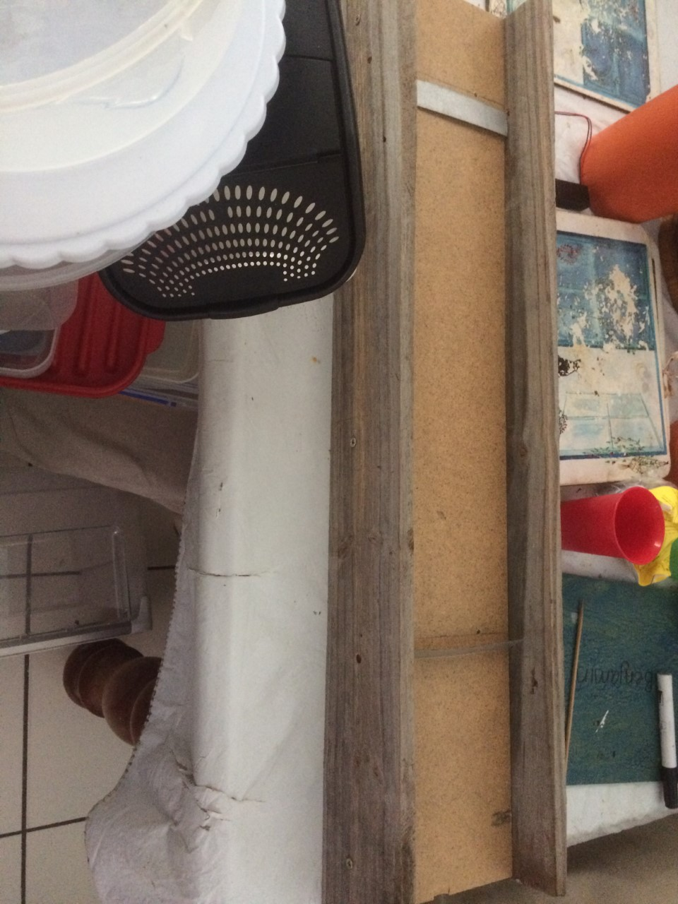

# Assessment 1: Replication project

## Replication project choice ##
Timing gates

## Related projects ##

### Related project 1 ###
Timing gates (original)

https://makecode.microbit.org/projects/timing-gates

This is the original project that my assesment was based off of.

## Reading reflections ##

### Reading: Don Norman, The Design of Everyday Things, Chapter 1 (The Psychopathology of Everyday Things) ###

*What I thought before: Describe something that you thought or believed before you read the source that was challenged by the reading.*

*What I learned: Describe what you now know or believe as a result of the reading. Don't just describe the reading: write about what changed in YOUR knowledge.*

*What I would like to know more about: Describe or write a question about something that you would be interested in knowing more about.*

*How this relates to the project I am working on: Describe the connection between the ideas in the reading and one of your current projects or how ideas in the reading could be used to improve your project.*

### Reading: Chapter 1 of Dan Saffer, Microinteractions: Designing with Details, Chapter 1 ###

*What I thought before: Describe something that you thought or believed before you read the source that was challenged by the reading.*

*What I learned: Describe what you now know or believe as a result of the reading. Don't just describe the reading: write about what changed in YOUR knowledge.*

*What I would like to know more about: Describe or write a question about something that you would be interested in knowing more about.*

*How this relates to the project I am working on: Describe the connection between the ideas in the reading and one of your current projects or how ideas in the reading could be used to improve your project.*

### Reading: Scott Sullivan, Prototyping Interactive Objects ###

*What I thought before: Describe something that you thought or believed before you read the source that was challenged by the reading.*

*What I learned: Describe what you now know or believe as a result of the reading. Don't just describe the reading: write about what changed in YOUR knowledge.*

*What I would like to know more about: Describe or write a question about something that you would be interested in knowing more about.*

*How this relates to the project I am working on: Describe the connection between the ideas in the reading and one of your current projects or how ideas in the reading could be used to improve your project.*

## Interaction flowchart ##

## Process documentation

The process involved taking the initial project of the timing gates and adjusting it to be more precise and actualy calculate the speed rather than just the time. the speed gates also must be able to calculate the speed of objects other than a car. The initial idea was to use a light sensor to detect when the object goes past. However, the light sensors were also far too inacurate and after going over multiple ideas we finaly came up with a mechanism that might work. it uses buttons instead of light sensors and uses a cut up skewer to reach the button.

## Project outcome ##

### Project title ###
speed gates
### Project description ###

the speed gates measure the speed of small objects passing through. the speed gates are too imprecise for scientific use, however, they could make a fun toy for young children interested in science or playing with toy cars. the timng gates require a small ofject to pass the two pannels and press them down, so it can be used by children to challenge themselves or their friends to roll objects across the board.

### Showcase image ###

### Reflection ###

the project went very well in my opinion. there wern't too many issues, however, i discovered that the buttons aren't pressed if the object goes over the switches too fast and if you roll an object too slow it may not make it across.

i did not use any other projects for assistance and much of the original project made things harder. i did however, share some ideas with my father before coming up with the final design.

this project, although inaccurate, if improved could help with basic science and recording the speed of rolling objects.
